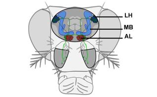
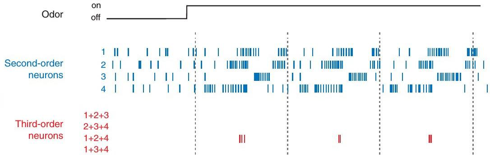
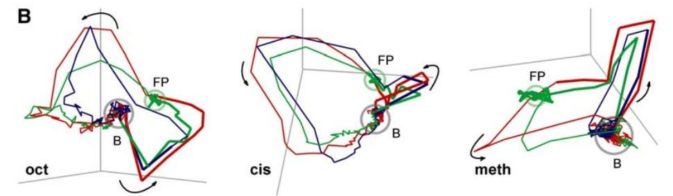
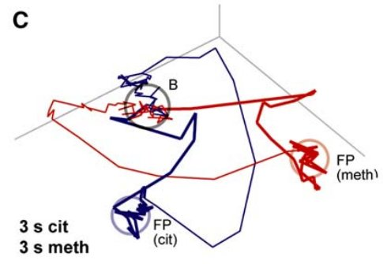
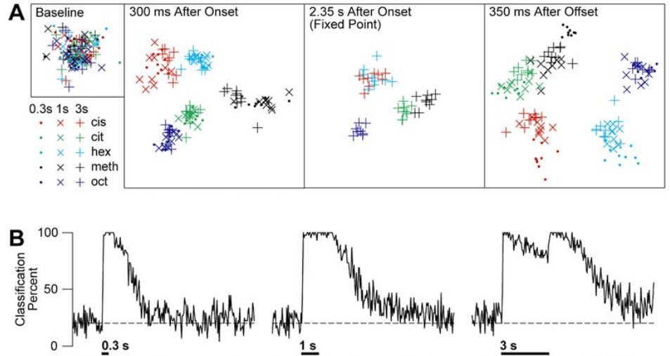
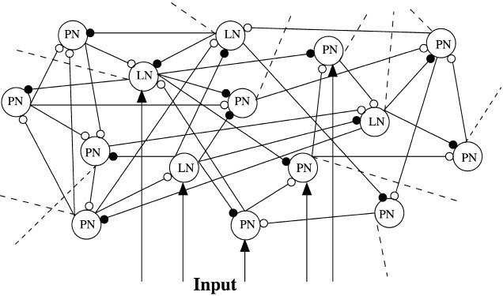
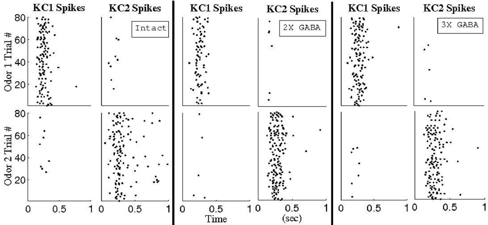

% Early events in olfactory processing in locust
% Mogei Wang
% 2015, Shanghai

------

# Outline

#### 1 Introduction
#### 2 Gross anatomy of insects' olfactory systems
#### 3 Investigations on early stage olfactory processing
### 

------

# 1 Introduction

## 1.1 Olfactory system is important
### to individual and society

### 

------

## 1.2 Dimensionality of odor space is very high

Odor molecules differ with each other in many physical and biochemical aspects.

1. The differences between odor molecules are discrete.
1. The differences cannot be adequately captured by just a few variables.

- Chemical stimuli are difficult to parameterize or *manipulate*.

------

## 1.3 Olfactory system is different

The olfactory system disobeys some general rules of sensory systems:

1. It has a large amount of different types of receptors.
1. It does not pass through thalamus before reaching cortex.
1. It has less preprocessing steps.

- *Can the olfactory system be cheated?*

------

# 2 Gross anatomy of insects' olfactory system

### 

1. Their olfactory pathway starts at the antennae.
1. **Olfactory receptor neurons (ORNs)** in antennae carry the information on the odor to **antennal lobe (AL)**.
1. **The odor information is transformed by the *projection neurons (PNs)* and *local neurons (LNs)* in AL.**
1. PNs relay olfactory information to higher brain centers, e.g., **mushroom body (MB)** and lateral horn (LH).

------

## Pathway in insects' AL

### 

1. 4 kinds of neurons, ORNs, PNs (soma), LNs (soma), ENs.
1. Most ORNs accept only one kind of odor molecules.
1. PN: excitatory, 1 **glomerulus**; LN: inhibitory, no axon.
1. EN: send feedback from higher brain centers.

------

## Notes for locust
1. Locust's PN are mostly multiglomerular.
1. |--------------------|-----------------|
   | Cells              | Numbers         |
   |--------------------|-----------------|
   | ORNs               | ~ 90 thousands  |
   | PNs                | ~ 900           |
   | LNs                | ~ 300           |
   | KCs                | ~ 50 thousands  |

	Kenyon cells (KCs) are mushroom body neurons.

- **Note for all insects:** Their LNs can cross their ALs.
- For locusts, the PNs can also cross AL?

------

# 3 Investigations on early stage olfactory processing

It is mainly

- considered to be an encoding or representation problem;
- feature abstraction, et al (information can be lost)?
- discussed based on the problem of classification.
	1. Spatial representation.
	1. Temporal representation:
		- Laurent et al's work
		- Cai et al's work

------

## 3.1 Spatial representation

### 

- Retinotopic maps in visual cortex
- Isofrequency bands in auditory cortex
- Somatotopic maps in somatosensory cortex
- **Is odor space mapped in AL in a similar way?**

------

### Criterion of spatial coding

According to Knudsen et al. (1987), a map can be defined as a sensory representation where

1. Responses to particular stimulus are spatially clustered;
1. There is a systematic relationship between a neuron's tuning and its spatial position.

------

### Nearby glomerulus response to more common odors

On the dorsal surface of **mammalian olfactory bulb (OB)**,

- Responses to aliphatic aldehydes and carboxylic acids tend to cluster in the anteromedial portion of OB.
- Responses to ketones, aliphatic alcohols, and phenols cluster in the lateral portion.
- Responses to hydrocarbons cluster in the ventral portion.

------

### A systematic relationship?

Systematic directional representations of other chemical features (size, polarity, etc.) have not been described in the OB.

1. Chemically similar odors tend to activate similar set of ORNs and similar glomerulus. The previous findings demonstrate no mapping.
1. When single glomeruli are investigated, it appears that nearby glomeruli can differ dramatically in odor tuning.
1. Given the high dimensionality of odor space, it is not obvious how a truly systematic relationship may exist.

------

### My comment on spatial representation
Main idea: odor representation is a map from odor space to AL.

- There are nontrivial findings.
- Olfactory systems can distinguish similar odor mixtures.  
  Is it a good idea to use spatial representation?
- Insects' LNs cross their ALs, and that may easy to cause global dynamics in ALs.

------

## 3.2 Temporal representation

### 

An odor and cell specific spike train.

Only ~5-10% of Kenyon cells respond to any given odor, and the Kenyon cells that do respond fire only a few spikes.

------

### Criterion of temporal coding

According to Wilson et al (2006), there are two criteria defining a temporal code:

1. The spike fluctuations of a neuron must be faster than stimulus fluctuations, and
1. Spike fluctuations must contain information about the stimulus from the point of view of a decoder.

------

### Decoding Temporal Patterns

Fluctuation frequency usually is ignored here.

Decoding:

- Laurent et al's algorithm based on PCA
- Cai et al's algorithm on temporal bound neurons

------

### 3.2.1 Laurent et al's work on PC decoding
### Reliable response

- Each trial is divided into successive 50 ms time bins, aligned at odor pulse onset.
- The number of spikes produced by each PN in each time bin was measured, and a PN was described as responding during time bin if it produced at least one action potential in that bin over six or more of the nine trials tested.

------

### Percentage of responsive PN odor pairs
### 

- Only reliable responses are plot in the above subfigure.
- Stimulus durations are 0.3, 1, and 3s, respectively.

------

### Percentage of responsive PN odor pairs

1. At rest, fewer than 1% of all PNs response (reliably).
1. After odor onset, the percentage of reliably responsive PNs immediately rose to between 8% and 10%.
1. Of all the spikes produced during each time bin, 55% are due to the reliable responding PNs in that time bin.
1. The identities of PNs change from time bin to time bin.
1. ~50%-60% of PNs can be described as responding at some time over the entire population response duration.

------

### PCA they applied

For a given stimulus,

1. Divide the whole trial duration $l$ into small time bins with length $w$, then there will be $\frac{l}{w}$ time bins.
1. Suppose there are $n$ PNs, then we have a $n\times \frac{l}{w}$ matrix with each entry being the mean firing rate in the time bin.
1. Average the matrix entries over all the trials.
1. Perform **principal component analysis** on the matrix, project the $n$ dimensional data onto the first 3 principal components, and have the resulting 3 dimensional response orbits plotted.

------

### PC orbits
### 
### The same odor; durations are 0.3, 1, and 3s, respectively.

------

### According to Patel et al (2009):

There are 5 stages of the first three principal components yielded an odor response orbit:

1. a transient dynamic portion of the orbit after stimulus onset;
1. approach of the orbit to a fixed point (only when the stimulus duration is longer than 2s);
1. stability of the orbit at the fixed point until stimulus offset;
1. a transient dynamic deviation of the orbit away from rest after stimulus offset;
1. decay of the orbit back to the network's resting state.

- The first three principal components captured more than 90% of the total data variance.
- Stimulus-response orbits resulting from single trial data matrices are similar to trial-averaged orbits.
- But the curves are rather sharp, is that reasonable?

------

### 
### 
- Orbits for different odors are very different.
- Orbits for the same odors are stable. (abstract model?)

------

### A bit of basic ideas of WinnerLess Competition model

According to Rabinovich et al. (2001):

1. consider an unstable periodic $P$ orbit selected from a chaotic attractor ($P=\{p_1, p_2, \ldots, p_k\}, k>1$);
1. suppose odor $s$ corresponds to the point $p_s\in P$;
1. when odor $s$ arises, dynamics in a neighborhood of $p_s$ is changed from unstable to attactive in a time interval;
1. if each odor is corresponded to a periodic point on the attactor, then all PC orbits are included in the attactor.

- Although WLC dynamics may explain the transient portion of the PN-population response, a modification or a new framework may be needed to account for the fixed-point response. (Mazor and Laurent, 2005).

------

### Laurent et al's goal: track decoding success over time

### 

A) The activity of the PNs captured at four different time points. Only the first 2 principal components are plotted.
B) Odor classification percentage over time (Individual vectors were attributed to the odor with the nearest centroid in the corresponding time bin. **Violate causality??**)

------

### Evoluation of distances between orbits with time

### 

- Instantaneous distances between mean odor trajectories (mean computed pairwise across all five odors).
- Mean instantaneous trial-to-trial distances, computed pairwise across all trials from different odors (top traces) and within the same odor (bottom traces).

------

### My comment on PC decoding
Main idea: odor is encoded in time-variant neurons' activities.

- Are the memories, notions, ideas processed in this way?
- How can the information contained in the PC orbit be transmitted to the mushroom body without loss of information? Can it be well decoded/processed there?  
(Only ~100 PNs project to the mushroom body.)
- A real attractor structure? How the odor space is mapped to it? How neurons' dynamics, coupling topology, and local field potential (LFP) affect the structure of attactor?  
  (The 20Hz LFP in AL is an overall activity of the PNs.)

------

## 3.2.2 Cai et al's work
Cai et al studied the time-invariant role of neuron sets by examing the temporally bound triplets on a locust AL model (Patel et al 2013).

Insteasd of comparing PN activity to an odor template that evolves with time, a single, time-invariant odor template is sufficient suppose in their decoding scheme.

------

### About the model

Bazhenov et al (2001) proposed a model to simulate locust's AL. In their model, neurons (PNs and LNs) are Hodgkin-Huxley typed, and are randomly coupled through cholinergic (nACH), GABAergic (GABA), and slow synapse currents.

### 
    There are 90 PNs and 30 LNs in the network, and
	all connecting probabilities are 0.5.

------

### Cai et al's improvement on the model

Patel et al (2009) carefully adjusted the above model to make the model and its dynamics consistent with physiology and experiment observations:

1. sparse connectivity among PNs
1. weak PN-PN synapses
1. a prolonged rise and decay time of ORN input to PNs

------

### Cai et al's model
- The network consisted of randomly interconnected 90 PNs and 30 LNs with cell-type specific connection probabilities.
- PNs are equipped with Hodgkin-Huxley sodium (Na) and potassium (K) spiking currents, and a transient K current.
- LNs are equipped with a calcium (Ca) current, a calcium-dependent K current, and a traditional K current.
- PN cholinergic (nACH) synapses and LN GABAergic synapses are modeled by fast-activating synaptic currents.
- A slow inhibitory synaptic current from LNs to PNs is introduced to reproduce the slow temporal patterns.
- PNs receive background current input in the form of a Poisson spike train to reproduce the background PN fires.
- An odor stimulates a set of 36 PNs and 12 LNs.
- Each stimulated cell received stimulus current in the form of 200 independent 35 Hz Poisson spike trains.

------

### Preparations of temporal bound decoding

- Define $P_{j,k|i}$ as the probablity that $j$ and $k$ fire given $i$ fires, where $i,j,k$ consist an ordered triplet of PNs.

- Defined the **binding index (BI)** as the formula $$BI_{i,j,k} ={\mbox{min}}(P_{j,k|i}, P_{i,j|k}, P_{i,k|j}),$$ where $i,j,k$ consist a PN set.  
$BI_{i,j,k} = b$ implies that, whenever any one of the 3 PNs fires, the other 2 PNs will fire concurrently with at least a probability $b$  
($BI_{i,j,k} = 0$ implies the PNs never fire together, while $BI_{i,j,k} = 1$ implies the PNs always fire together).

------

### Configurations for odor specificity of triplets
- Stimulate the network with 2 odors (odor 1 and odor 2)
- Different odors stimulating differing subsets of neurons
- Use a BI threshold of 0.65 to extract temporally bound triplets for each odor
- Networks are devoid of slow inhibition, but are still with operational GABA currents
- Suppose there are $n_A$ ($n_B$) PNs in neuron subset $A$ ($B$) corresponding to the odor 1 (2), with $s$ PNs present in both subsets, then the SDR is given by the formula SDR $$SDR=\frac{2({\mbox{min}}(n_A,n_B)-s)}{n_A+n_B}.$$ The SDR takes values close to 0 for two subsets of PNs that very similar in composition,  and vice versa.

-------

### Odor specificity of triplets
### 
- As the 2 odors become more dissimilar, the SDR rises and approaches unity in all three networks examined.
- Even for similar odors the SDR assumes non-zero values. Temporally bound triplets are sensitive to input variations.
- A randomly connected neuron network can have so interesting dynamical feature...

------

### In the presence of slow inhibition current

- Such a code cannot be undetected by their method in the network with slow inhibition current.
- The authors noticed that, following stimulus onset, the slow inhibitory current required several hundred milliseconds to grow in strength and reach a steady-state.
- They conjecture that a GABA-dependent binding code was indeed embedded in the network's dynamics.
- It was undetected because it materialized only in a small time window close to stimulus onset, before temporally bound PNs were selectively silenced by slow inhibition.
- The authors hypothesize that GABA is responsible for the emergence of the temporal binding code, while the slow inhibition is to quiet temporally bound neurons once a newly encountered odor has been detected.

------

### Contribution of slow inhibition and GABA currents

According to the study conduced by Patel et al (2009):

1. If GABA input to PNs is removed, then LFP in AL will be lost, but the resulting PC orbits exhibit qualitatively similar behavior to that of the fully intact network.
1. If slow inhibition is removed from the network, the LFP oscillations will keep intact (or enhanced), but the response orbits are drastically changed (after stimulus offset, the orbit essentially retrace its path back to rest).

According to Mazor and Laurent (2005), the mean oscillatory power of LFP reaches a peak in ~300 ms of PN-population activation onset. The period of peak oscillatory power corresponds to the dynamic phase when the PN-population vector evolves away from rest but before it reaches its odor-specific fixed point.

------

### Examination of temporal bound neurons
### 

- The authors constructed hypothetical, odor-specific KCs.
- For each odor, use BI threshold ~0.65 to recover triplets.
- The odor $k$-specific KC (KC $k$) designated to fired, whenever ~70% PNs corresponding to odor $k$ spiked.
- KC $k$ responds during (almost only) in trials of odor $k$.

------

### My comment on Cai et al's work
Main idea: odor representation is the redistribution of charges.

- Seems very reasonable a decoding scheme, but cannot be approved by experiments soon. (Recordings cannot be collected simultaneously from many cells.)
- How much information is contained in the selected spikes? Are there some key dynamical features lost (at some click, most PNs may spike together)?
- Is it supported by connection topology between PNs and KCs? How much of the synchrony spiking information is sent to mushroom body? Do ORNs map odors to PNs and LNs in the expected way?
(Only ~100 PNs project to MB.)
- What is the capacity of a given network? How many odors can be identified in total in this way?
- Can reliably responses be reproduced in their simulation? How about the PC orbits of temporal bound neurons?

------

# 4 Summary

1. A rather simple chemical and biological device have done really nontrivial encodings.
1. The temporal decoding schemes seems very promising.
- Laurent et al's scheme: takes an odor as a whole thing.
- Cai et al's scheme: different neuron plays different role.
1. Synchronization of PN spikes may have played an important role.
1. The onset transient process may be very important.
1. The redundant odor stimulus is suppressed.

------

# Further thinkings

1. More attention to be paid on the connections among ORNs, PNs/LNs, and KCs. (analog information?)
1. Other coupling topologies? Compare structure and features of locust AL with the other insects' ALs?
1. More refined data on stimulus and neurons activity would be helpful, e.g., AL's responses for carefully mixed odors.

------

# Main References
1. R I Wilson, Z F Mainen. Early events in olfactory processing. Annual Review of Neuroscience, 29, 163, 2006
1. O Mazor, G Laurent. Transient dynamics versus fixed points in odor representations by locust antennal lobe projection neurons. Neuron, 48, 661, 2005
1. M Patel, A V Rangan, D Cai. A large-scale model of the locust antennal lobe. Journal of Computational Neuroscience, 27, 553, 2009
1. M Patel, A V Rangan, D Cai. Coding of odors by temporal binding within a model network of the locust antennal lobe. Frontiers in Computational Neuroscience, 7, 50, 2013
1. and many others...

-------

## Thank you for your attention!
## Questions?
## 

-------

## Thank you for your attention!
## Questions?
## 
